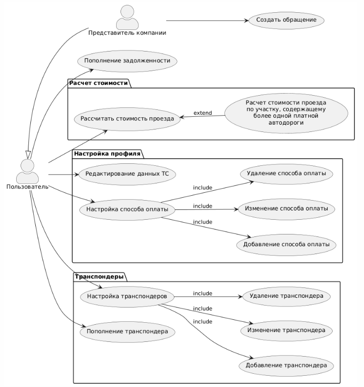
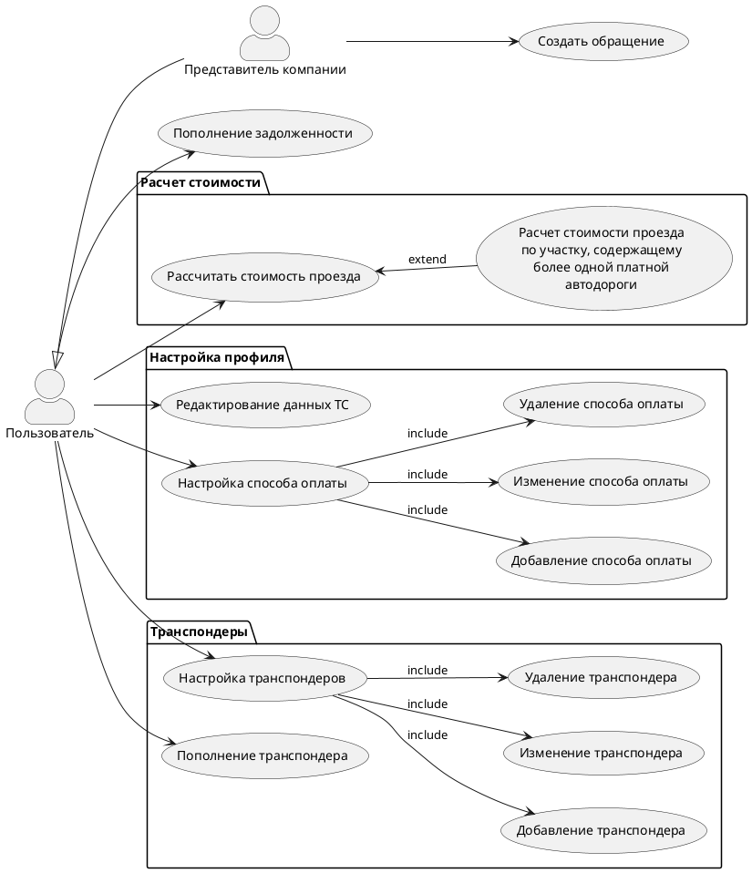

# Диаграмма вариантов использования (use case)

```plantuml
@startuml

left to right direction
skinparam actorStyle awesome

actor "Пользователь" as u
actor "Представитель компании" as c

usecase "Создать обращение" as UC1

package "Расчет стоимости" {
  usecase "Рассчитать стоимость проезда" as UC2
  usecase "Расчет стоимости проезда\nпо участку, содержащему\nболее одной платной\nавтодороги" as UC3
}

package "Настройка профиля" {
  usecase "Редактирование данных ТС" as UC4
  usecase "Настройка способа оплаты" as UC5
  usecase "Добавление способа оплаты" as UC6
  usecase "Изменение способа оплаты" as UC7
  usecase "Удаление способа оплаты" as UC8
}

package "Транспондеры" {
  usecase "Настройка транспондеров" as UC9
  usecase "Добавление транспондера" as UC10
  usecase "Изменение транспондера" as UC11
  usecase "Удаление транспондера" as UC12
  usecase "Пополнение транспондера" as UC13
}

usecase "Пополнение задолженности" as UC14

u --> UC2
u --> UC4
u --> UC5
u --> UC9
u --> UC13
u --> UC14
UC2 <-- UC3: extend
UC5 --> UC6: include
UC5 --> UC7: include
UC5 --> UC8: include
UC9 --> UC10: include
UC9 --> UC11: include
UC9 --> UC12: include
u <|-- c
c --> UC1

@enduml
```