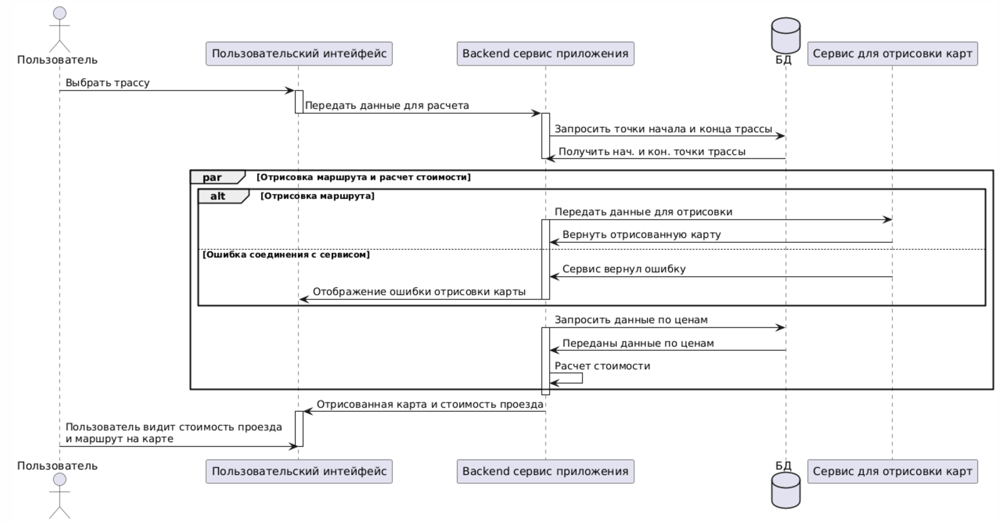
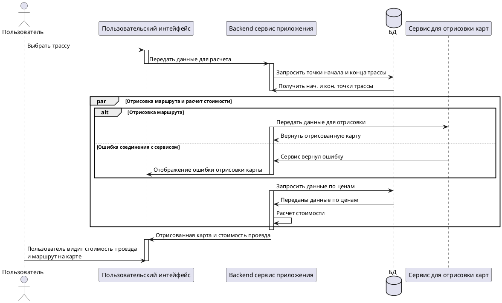

# Диаграмма последовательности (sequence)

```plantuml
@startuml


actor "Пользователь" as u
participant "Пользовательский интейфейс" as ui
participant "Backend сервис приложения" as b
database "БД" as db
participant "Сервис для отрисовки карт" as s


u -> ui: Выбрать трассу
activate ui
ui -> b: Передать данные для расчета
deactivate ui

activate b
b -> db: Запросить точки начала и конца трассы
db -> b: Получить нач. и кон. точки трассы
deactivate b

par Отрисовка маршрута и расчет стоимости

alt Отрисовка маршрута
b -> s: Передать данные для отрисовки
activate b
s -> b: Вернуть отрисованную карту

else Ошибка соединения с сервисом
s -> b: Сервис вернул ошибку
b -> ui: Отображение ошибки отрисовки карты
deactivate b
end

b -> db: Запросить данные по ценам
activate b
db -> b: Переданы данные по ценам
b -> b: Расчет стоимости
end

deactivate b
b -> ui: Отрисованная карта и стоимость проезда
activate ui
u -> ui: Пользователь видит стоимость проезда\nи маршрут на карте
deactivate ui


@enduml
```